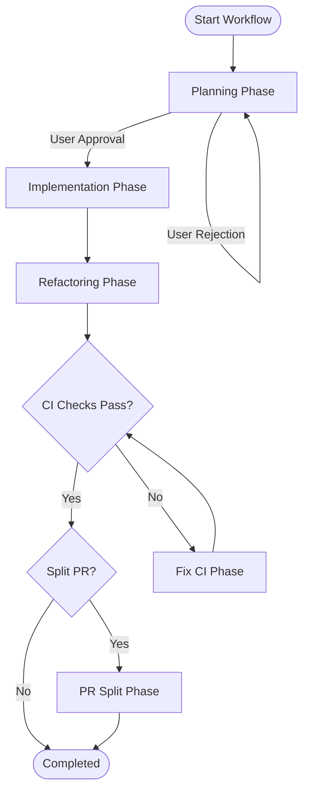

# Claude Code Tools

A collection of CLI tools for working with Claude Code.

## Tools

- **Generator** - Generate prompts for creating Claude Code skills, agents, and commands
- **Workflow** - Orchestrate multi-phase development workflows with Claude Code

## Workflow

The `workflow` tool orchestrates multi-phase development workflows by invoking Claude Code CLI with persistent state management. It automates the process of planning, implementing, and refactoring code changes.

### Workflow Phases



### Installation

```bash
go install github.com/michael-freling/claude-code-tools/cmd/workflow@latest
```

Or build from source:

```bash
go build -o workflow cmd/workflow/main.go
```

### Usage

```bash
# Start a new feature workflow
workflow start my-feature "Add user authentication" --type feature

# Start a bug fix workflow
workflow start fix-login "Fix login form validation" --type fix

# List all workflows
workflow list

# Check workflow status
workflow status my-feature

# Resume an interrupted workflow
workflow resume my-feature

# Delete a workflow
workflow delete my-feature

# Clean up completed workflows
workflow clean
```

### Options

| Flag | Description | Default |
|------|-------------|---------|
| `--base-dir` | Base directory for workflow state | `.claude/workflow` |
| `--split-pr` | Enable PR split phase for large PRs | `false` |
| `--claude-path` | Path to Claude CLI executable | `claude` |
| `--timeout-planning` | Planning phase timeout | `1h` |
| `--timeout-implementation` | Implementation phase timeout | `6h` |
| `--timeout-refactoring` | Refactoring phase timeout | `6h` |
| `--timeout-pr-split` | PR split phase timeout | `1h` |
| `-v, --verbose` | Enable verbose output | `false` |

## Generator

The `generator` tool outputs prompts to stdout that you can give to Claude to create skills, agents, and commands.

### Installation

```bash
go install github.com/michael-freling/claude-code-tools/cmd/generator@latest
```

Or build from source:

```bash
go build -o generator cmd/generator/main.go
```

### Usage

#### Agents

```bash
# List all available agents
generator agents list

# Generate prompt for a specific agent
generator agents golang-engineer
generator agents software-architect
```

Available agents:
- `golang-engineer` - Go development with full verification and testing
- `golang-code-reviewer` - Review Go code for best practices
- `typescript-engineer` - TypeScript/Next.js development with testing
- `typescript-code-reviewer` - Review TypeScript code
- `software-architect` - Design software architecture and API specifications
- `architecture-reviewer` - Review architectural designs
- `github-actions-workflow-engineer` - Create and test GitHub Actions workflows

#### Commands

```bash
# List all available commands
generator commands list

# Generate prompt for a specific command
generator commands feature
generator commands fix
```

Available commands:
- `feature` - Add or update a feature with architecture design and review
- `fix` - Fix a bug by reproducing, understanding root cause, and planning fixes
- `refactor` - Refactor code with structured workflow
- `document-guideline` - Create comprehensive project guidelines
- `document-guideline-monorepo` - Create guidelines for monorepo subprojects
- `split-pr` - Split large PRs into smaller, reviewable child PRs

#### Skills

```bash
# List all available skills
generator skills list

# Generate prompt for a specific skill
generator skills coding
generator skills ci-error-fix
```

Available skills:
- `coding` - Iterative development with Test-Driven Development (TDD)
- `ci-error-fix` - Fix CI errors systematically

#### Custom Templates

Use your own templates by specifying a custom template directory:

```bash
generator agents --template-dir /path/to/templates golang-engineer
generator commands -t /path/to/templates feature
```

## Testing

### Unit Tests

```bash
# Run all unit tests
go test ./...

# Run with coverage
go test -coverprofile=coverage.txt ./...
go tool cover -func=coverage.txt
```

### E2E Tests

E2E tests use real git, gh, and claude CLI commands. They are separated using Go build tags.

```bash
# Run e2e tests using the script (recommended)
./scripts/run-e2e-tests.sh

# Run e2e tests directly
go test -tags=e2e ./test/e2e/...

# Run with verbose output
E2E_VERBOSE=true ./scripts/run-e2e-tests.sh
```

See [test/e2e/README.md](test/e2e/README.md) for detailed e2e testing documentation.

## License

MIT
